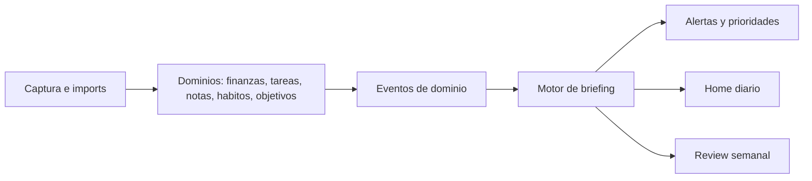
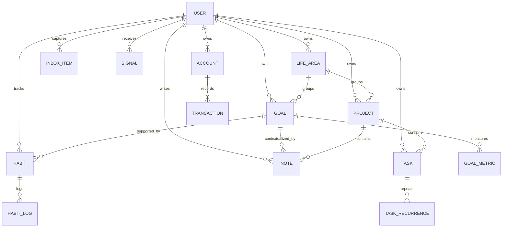

# Propuesta de Producto: Dashboard Integral Personal

## 1. Definicion del producto

### Tesis
La app debe funcionar como un sistema operativo personal, no como un tablero de KPIs. Su trabajo es responder, cada vez que la abras, tres preguntas:

1. Que cambio desde la ultima vez.
2. Que importa de verdad ahora.
3. Que deberias hacer hoy para no perder control.

### Problema real que resuelve
Hoy la informacion personal suele estar repartida entre banco, notas, calendario, listas de tareas, recordatorios y aplicaciones de habitos. El problema no es solo la dispersion, sino que ninguna capa superior interpreta el conjunto. Eso genera tres fallas:

- reaccion en vez de direccion;
- trabajo invisible que no conecta con objetivos;
- mala lectura del costo real de decisiones de tiempo, dinero y energia.

### Promesa del producto
Convertir datos dispersos en control operativo diario. La app no solo muestra estados; detecta riesgos, conecta piezas y propone las siguientes acciones mas utiles.

### Usuario objetivo del MVP
Una sola persona, uso individual, perfil conocimiento/creativo/independiente o profesional con carga mental media o alta. Necesita coordinar:

- finanzas personales;
- tareas y proyectos;
- notas operativas;
- habitos de mantenimiento;
- objetivos trimestrales o anuales.

### Principios de producto

- Decision first: primero acciones y excepciones, despues metricas.
- Una fuente de verdad por dominio: evitar duplicar tareas, notas o movimientos.
- Captura rapida, claridad posterior: anotar debe ser facil; organizar, opinionado.
- Menos listas, mas compromisos: el sistema debe empujar a decidir, no a acumular.
- Manual primero, integraciones despues: la utilidad no puede depender de una red de APIs fragiles.
- Pocas cosas activas al mismo tiempo: el producto debe limitar, no amplificar ruido.

### Anti-objetivos

- No construir un ERP personal.
- No ser un "second brain" infinito.
- No ser una app de productividad generica con cinco modulos sueltos.
- No depender de IA para inventar prioridades sin contexto.
- No intentar resolver salud, finanzas, trabajo, diarios y relaciones con el mismo nivel de profundidad desde el dia uno.

## 2. Enfoque del MVP

### Objetivo del MVP
Que despues de 30 dias de uso la app consiga esto:

- darte una lectura diaria confiable de situacion financiera y operativa;
- reducir la friccion para capturar pendientes y convertirlos en acciones;
- mostrar si tus objetivos estan avanzando o se estan degradando;
- sostener una revision semanal simple pero consistente.

### Modulos incluidos en el MVP

| Modulo | Para que existe | Lo minimo que debe hacer |
| --- | --- | --- |
| Home / Briefing | Sintetizar la situacion | Resumen diario, alertas, prioridades, recomendaciones |
| Inbox | Capturar todo sin decidir de inmediato | Texto rapido, adjuntos simples, clasificacion posterior |
| Finanzas | Dar control del mes y anticipar tension | Cuentas, movimientos, gastos por categoria, obligaciones proximas |
| Tareas | Ejecutar y priorizar | Inbox, hoy, proximas, proyectos, recurrencias basicas |
| Notas | Guardar contexto util | Notas rapidas, notas de decision, notas ligadas a tareas/proyectos |
| Habitos | Sostener mantenimiento personal | Seguimiento diario/semanal, objetivos minimo y deseado |
| Objetivos | Dar direccion y criterio | 3 a 5 objetivos activos, metricas, hitos y vinculos con tareas/habitos |
| Review semanal | Cerrar el loop | Estado, aprendizajes, riesgos y ajustes |

### Lo que queda fuera del MVP

- multiusuario o colaboracion;
- contabilidad avanzada o inversiones sofisticadas;
- editor de notas complejo tipo Notion;
- sincronizacion bancaria completa en tiempo real;
- calendario bidireccional;
- automatizaciones "inteligentes" opacas;
- app mobile nativa.

### Diferencial real del MVP
La capa diferencial no es el numero de modulos sino el motor de interpretacion. Cada dominio produce senales. El sistema cruza esas senales y arma una lectura accionable:

- "tenes 4 dias de margen antes de un cuello de caja";
- "tu objetivo de salud esta en riesgo porque esta semana cayeron los dos habitos soporte";
- "este proyecto consume tiempo pero no mueve ningun objetivo activo";
- "hay demasiado trabajo en 'hoy'; deberias sacar tres items de bajo impacto".

## 3. Core loop diario

1. Capturar rapido: ideas, gastos, tareas, notas y pendientes.
2. Normalizar: clasificar y vincular cada item a un dominio, proyecto u objetivo.
3. Evaluar: detectar vencimientos, desviaciones y acumulaciones peligrosas.
4. Priorizar: elegir que entra en hoy y que puede esperar.
5. Ejecutar: completar acciones y registrar progreso.
6. Revisar: cierre diario ligero y review semanal mas profunda.

Si este loop no funciona en menos de 10 minutos diarios de administracion, el producto esta fallando.

## 4. Arquitectura recomendada

### Decisiones clave

- Web app responsive primero, con PWA.
- Monolito modular antes que microservicios.
- Base de datos unica y consistente.
- Capa de jobs para generacion de briefing, recurrencias y snapshots.
- Integraciones desacopladas, nunca acopladas al core.

### Stack sugerido

- Frontend: Next.js + TypeScript.
- UI: Tailwind CSS + sistema de componentes propio, no dashboard template.
- Backend: servicios de dominio dentro del mismo repositorio.
- Base de datos: PostgreSQL.
- ORM: Prisma o Drizzle.
- Jobs: scheduler + queue liviana para briefings, recurrencias y recalculos.
- Search: full-text search nativa de PostgreSQL para notas y captura.
- Auth: login simple de un solo usuario o cuenta personal con magic link.

### Por que esta arquitectura

- Un monolito modular es suficiente para un producto single-user o small-scale y reduce complejidad.
- PostgreSQL cubre bien transacciones, relaciones y reporting simple.
- La PWA te da acceso movil suficiente para captura y consulta sin pagar el costo de dos apps nativas.
- Separar "dominios" dentro del monolito permite crecer sin redisenar desde cero.

### Modulos de dominio

- `finance`: cuentas, movimientos, presupuestos, obligaciones.
- `execution`: tareas, proyectos, recurrencias, foco diario.
- `knowledge`: notas, capturas, contexto y enlaces.
- `habits`: definiciones, logs, frecuencia, minima dosis.
- `planning`: objetivos, hitos, metricas, revisiones.
- `briefing`: senales, scoring, alertas y recomendaciones.
- `integrations`: importadores y conectores externos.

### Flujo de informacion

1. El usuario crea o importa datos.
2. Cada modulo produce eventos de dominio.
3. El motor de briefing procesa esos eventos y genera senales.
4. Las senales alimentan Home, Today y Review.

## 5. Modelo de datos

### Entidades transversales

| Entidad | Campos clave | Rol |
| --- | --- | --- |
| `user` | id, timezone, preferences | Configuracion y contexto |
| `life_area` | id, name, order, color | Agrupar objetivos y proyectos por area de vida |
| `project` | id, title, status, life_area_id | Contenedor operativo de tareas y notas |
| `goal` | id, title, type, target_date, status, life_area_id | Resultado que importa |
| `goal_metric` | id, goal_id, metric_type, current_value, target_value | Medicion del objetivo |
| `inbox_item` | id, raw_text, source_type, captured_at, triaged_at | Punto de entrada universal |
| `signal` | id, type, severity, status, entity_type, entity_id, reason | Alerta o insight generado |
| `entity_link` | id, from_type, from_id, to_type, to_id, relation_type | Relacionar tareas, notas, objetivos, gastos |
| `review_snapshot` | id, period_type, period_start, summary_json | Foto historica para comparar periodos |

### Finanzas

| Entidad | Campos clave | Rol |
| --- | --- | --- |
| `account` | id, name, type, currency, current_balance | Caja, banco, billetera, tarjeta |
| `transaction` | id, account_id, amount, direction, category, occurred_on, status | Movimiento individual |
| `recurring_transaction` | id, kind, expected_amount, cadence, next_due_on | Obligacion o ingreso recurrente |
| `budget_bucket` | id, month, category, planned_amount, actual_amount | Control mensual por categoria |
| `cashflow_snapshot` | id, month, opening_balance, closing_projection | Proyeccion del mes |

### Tareas y proyectos

| Entidad | Campos clave | Rol |
| --- | --- | --- |
| `task` | id, title, status, priority_score, due_at, energy_level, project_id | Unidad ejecutable |
| `task_recurrence` | id, task_id, cadence, next_run_at | Reglas de repeticion |
| `task_session` | id, task_id, started_at, ended_at, outcome | Registro opcional de ejecucion |

### Notas

| Entidad | Campos clave | Rol |
| --- | --- | --- |
| `note` | id, title, note_type, body_md, project_id, goal_id, updated_at | Contexto operativo y reflexivo |
| `note_attachment` | id, note_id, file_url, mime_type | Soporte liviano para archivos |

### Habitos

| Entidad | Campos clave | Rol |
| --- | --- | --- |
| `habit` | id, title, cadence, minimum_target, stretch_target, linked_goal_id | Rutina con criterio de exito |
| `habit_log` | id, habit_id, logged_on, value, status | Cumplimiento diario o semanal |

### Relacion simplificada

### Regla importante de modelado
No mezclar todo en una entidad "item" abstracta. Conviene tener entidades claras por dominio y una capa transversal de enlaces (`entity_link`) y senales (`signal`). Eso mantiene el modelo flexible sin volverlo ambiguo.

## 6. Logica de negocio

### 6.1 Motor de briefing
El briefing es el corazon del producto. Se genera automaticamente cada manana y se recalcula al abrir si hay cambios recientes.

#### Inputs

- tareas vencidas y proximas;
- obligaciones financieras dentro de 7, 14 y 30 dias;
- gasto real vs presupuesto esperado;
- habitos omitidos o degradados;
- objetivos sin progreso;
- items en inbox sin procesar;
- decisiones manuales marcadas como prioridad.

#### Outputs

- estado general del dia: verde, amarillo o rojo;
- top 3 prioridades del dia;
- alertas ordenadas por severidad;
- recomendacion explicita por cada alerta;
- lista "puede esperar".

### 6.2 Scoring de tareas
Cada tarea deberia tener un `priority_score` calculado, no manual puro.

Formula sugerida:

`priority_score = urgencia + impacto + alineacion_objetivo + valor_de_desbloqueo - costo_de_energia - friccion`

Escalas simples de 1 a 5 bastan para el MVP. Lo importante es que el sistema limite la lista "Hoy" a:

- 3 tareas criticas;
- 3 tareas de mantenimiento;
- tareas ultracortas solo si desbloquean algo.

### 6.3 Reglas de finanzas

- Calcular `runway` con balance liquido menos reservas obligatorias.
- Proyectar saldo de fin de mes usando ingresos esperados y egresos recurrentes.
- Senalar categorias que gastan por encima del ritmo esperado del mes.
- Detectar movimientos inusuales por monto o categoria.
- Marcar riesgo cuando una obligacion futura no tiene cobertura de caja clara.

### 6.4 Reglas de habitos

- Cada habito tiene una "dosis minima" y una "dosis ideal".
- No usar racha como KPI principal.
- Riesgo si el habito cae por debajo de la dosis minima en ventana movil.
- Si un habito soporta un objetivo, su incumplimiento aumenta el riesgo del objetivo.

### 6.5 Reglas de objetivos

- Maximo 3 a 5 objetivos activos.
- Cada objetivo debe tener una metrica verificable.
- Cada objetivo debe tener al menos un hito, un conjunto de tareas y uno o dos habitos soporte.
- Riesgo si no hubo progreso en X dias.
- Riesgo si hay tareas activas que consumen tiempo pero no apoyan ningun objetivo activo.

### 6.6 Reglas de notas

- Tipos minimos: captura, referencia, decision, review.
- Una nota gana valor cuando queda ligada a tarea, proyecto u objetivo.
- Notas sueltas no deben dominar la interfaz; deben vivir en captura o archivo.

### 6.7 Review semanal
Pantalla guiada con pasos fijos:

1. Que paso esta semana.
2. Que quedo abierto.
3. Como se movio tu dinero.
4. Que objetivos avanzaron o se frenaron.
5. Que entra y que sale de la semana siguiente.

El resultado debe ser un snapshot y un set de decisiones, no una libreta interminable.

## 7. Pantallas clave

| Pantalla | Objetivo | Componentes clave |
| --- | --- | --- |
| Home / Daily Briefing | Dar lectura inmediata del sistema | Veredicto del dia, alertas, top 3, cambios desde ayer |
| Inbox | Captura sin friccion | Input rapido, clasificacion sugerida, items pendientes de triage |
| Today | Ejecutar sin ruido | Tareas de hoy, bloqueos, habitos del dia, decisiones pendientes |
| Money | Control financiero operativo | Balance, flujo del mes, proximos vencimientos, categorias en tension |
| Tasks | Gestionar trabajo pendiente | Inbox, proximas, por proyecto, recurrencias |
| Notes | Consultar contexto util | Notas vinculadas, decision log, busqueda |
| Habits | Mantener rutinas base | Habitos de hoy/semana, cumplimiento minimo, tendencia |
| Goals | Alinear acciones con direccion | Objetivos activos, metricas, hitos, soporte operativo |
| Weekly Review | Recalibrar | Snapshot, aprendizajes, decisiones, plan de la proxima semana |
| Settings / Integrations | Configurar comportamiento | categorias, cuentas, reglas, imports, conectores |

### Pantalla Home: composicion recomendada

1. Header con fecha, estado general y una frase clara.
2. Bloque "Lo importante hoy".
3. Alertas por severidad con CTA unico.
4. Mini resumen por dominio: dinero, ejecucion, habitos, objetivos.
5. Bloque "Puede esperar" para bajar ansiedad.

### Ejemplo de copy util

- "Hoy estas operativo, pero tu caja entra en zona de riesgo en 6 dias."
- "Hay demasiado en hoy. Conserva 3 tareas y manda 5 a proximas."
- "Tu objetivo de entrenamiento se esta enfriando: 4 dias sin la dosis minima."

## 8. Navegacion

### Desktop
Sidebar izquierda fija:

- Home
- Today
- Inbox
- Money
- Tasks
- Notes
- Habits
- Goals
- Review
- Settings

Panel derecho contextual opcional para:

- detalle del item seleccionado;
- nota relacionada;
- historial corto;
- accion rapida.

### Mobile
Bottom navigation de 5 entradas:

- Home
- Today
- Capture
- Money
- Review

Acceso a Tasks, Notes, Habits y Goals desde un sheet de "Areas".

### Patrones globales

- Quick capture permanente.
- Command palette para crear, buscar y navegar.
- Enlaces contextuales entre dominios.
- Cada alerta debe abrir una accion concreta, no solo detalle.

## 9. Roadmap recomendado

### Fase 1: Fundacion operativa
Duracion estimada: 2 semanas

- estructura del dominio;
- auth simple;
- diseno de navegacion;
- inbox universal;
- entidades base de tareas, notas, cuentas y objetivos.

### Fase 2: MVP utilizable
Duracion estimada: 4 a 6 semanas

- Home con briefing inicial;
- tareas con today y proyectos;
- finanzas basicas con cuentas, movimientos y obligaciones;
- habitos con logs simples;
- objetivos con metricas e hitos;
- review semanal.

### Fase 3: Capa de confianza
Duracion estimada: 3 a 4 semanas

- recurrencias robustas;
- snapshots historicos;
- reglas de riesgo mejoradas;
- imports CSV para movimientos;
- mejores enlaces entre notas, tareas y objetivos.

### Fase 4: Integraciones selectivas
Duracion estimada: 4 a 6 semanas

- calendario solo lectura;
- importadores bancarios o conciliacion manual asistida;
- correo o reenvio para captura;
- integracion opcional con GitHub si parte de tu trabajo diario vive en issues o PRs.

### Fase 5: Inteligencia util
Duracion estimada: posterior al product-market fit personal

- simulaciones "que pasa si" para dinero y tiempo;
- recomendaciones adaptativas segun historial;
- briefings narrativos mejores;
- automatizaciones puntuales con supervision.

## 10. Recomendaciones UX/UI

### Direccion de UX
La interfaz no debe parecer un dashboard empresarial. Debe sentirse como una mesa de control personal, editorial y tranquila, con foco en lectura y accion.

### Jerarquia visual

1. Primero: una conclusion en lenguaje humano.
2. Segundo: que hacer ahora.
3. Tercero: por que el sistema recomienda eso.
4. Cuarto: detalle y trazabilidad.

### Reglas de interfaz

- Menos tarjetas, mas bloques con rol claro.
- Un CTA principal por alerta.
- Graficos solo cuando ayudan a decidir; evitar chart spam.
- Los datos historicos deben vivir un nivel abajo, no en portada.
- Cada modulo debe poder explicarse en una frase.

### Lenguaje visual sugerido

- Tipografia: `General Sans` o `Satoshi` para UI; `IBM Plex Mono` para cifras y estados.
- Fondo: tonos calidos neutros, no blanco puro.
- Colores de estado: verde sobrio, ambar claro, rojo terroso, azul petroleo para informacion.
- Iconografia simple, sin decoracion excesiva.
- Movimiento ligero: entrada del briefing, cambios de estado y transiciones de prioridades.

### Componentes importantes

- card de veredicto diario;
- lista de alertas con gravedad;
- timeline de vencimientos;
- panel de objetivo con metrica + soporte operativo;
- captura rapida flotante;
- sheet de triage de inbox;
- review stepper semanal.

### Experiencia movil

- captura con un toque;
- scroll corto en Home;
- detalles en drill-down, no todo junto;
- acciones swipe para completar, posponer y vincular.

### Accesibilidad

- contraste alto;
- tipografia legible;
- targets tactiles amplios;
- teclado completo en desktop;
- nunca depender solo del color para estados.

## 11. Riesgos y decisiones criticas

### Riesgo 1: construir demasiados modulos superficiales
Mitigacion: lanzar solo lo que influye decisiones diarias. Si un modulo no cambia una accion, no entra.

### Riesgo 2: depender de integraciones desde el inicio
Mitigacion: manual-first, import-first. La utilidad debe sobrevivir sin APIs externas.

### Riesgo 3: convertir Home en un cementerio de widgets
Mitigacion: Home solo muestra conclusiones, alertas y decisiones. El detalle vive abajo.

### Riesgo 4: mezclar tareas, notas y objetivos sin criterio
Mitigacion: modelo separado por dominio y enlaces explicitos.

### Riesgo 5: premiar streaks en vez de progreso real
Mitigacion: dosis minima, cumplimiento semanal y soporte a objetivos.

## 12. Metricas de exito del producto

- apertura diaria en al menos 20 de 30 dias;
- tiempo medio de captura menor a 10 segundos;
- inbox procesado en menos de 24 horas la mayoria de los dias;
- precision de proyeccion financiera mensual razonable;
- completion rate de review semanal superior al 70%;
- reduccion visible de tareas "huerfanas" sin objetivo ni proyecto.

## 13. Recomendacion final
La mejor version de este producto no es la que integra todo primero, sino la que crea una capa fiable de criterio. Empezaria con una web app personal, opinionada, con briefings diarios, finanzas operativas, tareas ejecutables, habitos minimos y objetivos limitados.

Si el MVP logra responder bien "que pasa, que importa y que hago ahora", entonces vale la pena sumar integraciones, automatizaciones y analitica avanzada. Si no, cualquier feature extra solo agregara complejidad.

## 14. Siguiente paso recomendado
Convertir esta propuesta en tres artefactos concretos:

1. mapa de informacion y flujos;
2. wireframes de Home, Today, Money y Review;
3. schema tecnico inicial con tablas y relaciones reales.

Ese seria el punto correcto para pasar de estrategia a construccion.

